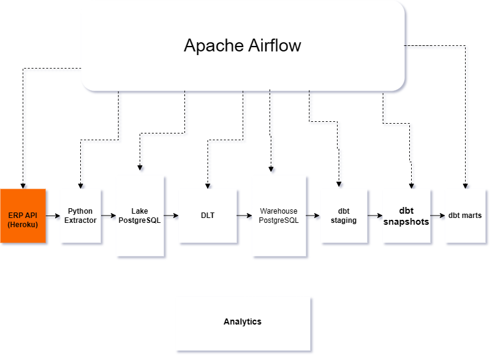
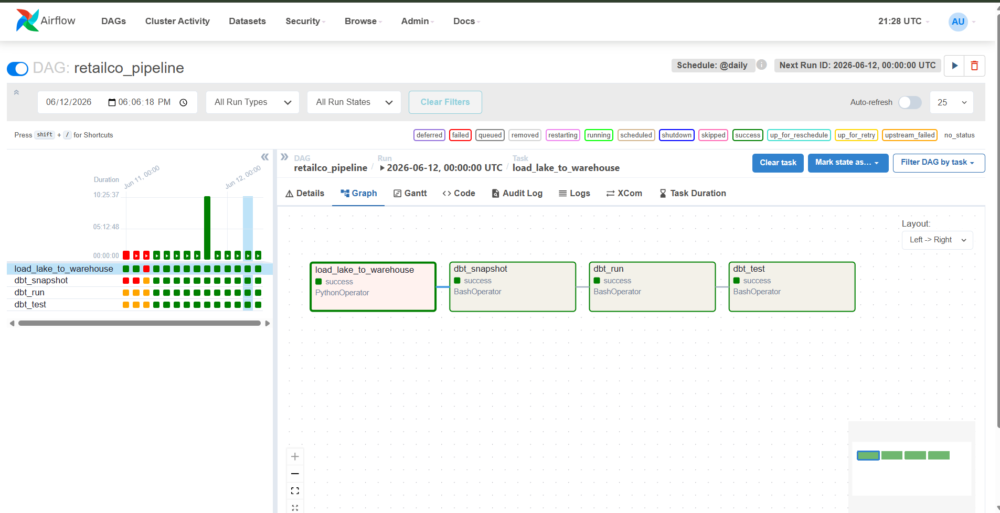

# RetailCo Modern Data Platform

## Project Overview

RetailCo is a modern end-to-end data engineering project that simulates a production-grade retail analytics platform.

The project extracts transactional retail data from an ERP-style PostgreSQL source system, loads it into a Lake database using incremental ingestion, transforms it into analytics-ready dimensional models using dbt, and orchestrates the entire workflow with Apache Airflow.

The platform demonstrates modern data engineering practices including:

* ELT architecture
* Incremental data loading
* Slowly Changing Dimensions (SCD Type 2)
* Data quality testing
* Workflow orchestration
* Dimensional modeling
* Business intelligence reporting

---

## Business Problem

Retail organizations generate data from multiple operational systems:

* Customers
* Orders
* Products
* Payments
* Inventory
* Employees
* Stores

Raw operational databases are optimized for transactions, not analytics.

This project creates a scalable analytics layer that enables:

* Revenue reporting
* Customer analysis
* Product performance tracking
* Payment analysis
* Inventory monitoring
* Store performance measurement

---

# Architecture

ERP Source Database
↓

Airbyte-style Incremental Extraction
↓

Lake Database (Raw Layer)
↓

dlt Load Pipeline
↓

Warehouse Database
↓

dbt Snapshots (SCD Type 2)
↓

dbt Staging Models
↓

dbt Dimensions + Fact Tables
↓

Data Quality Tests
↓

Power BI Dashboard

## Architecture Diagram

---

# Technology Stack

| Layer            | Technology     |
| ---------------- | -------------- |
| Source System    | PostgreSQL     |
| Data Lake        | PostgreSQL     |
| Data Warehouse   | PostgreSQL     |
| ELT Loading      | dlt            |
| Transformations  | dbt            |
| Orchestration    | Apache Airflow |
| Containerization | Docker         |
| Reporting        | Power BI       |
| Version Control  | GitHub         |

---

# Project Structure

Retailco/

├── airflow/

├── dags/

│ └── load_dag.py

│

├── dlt_pipeline/

│ └── load_pipeline.py

│

├── dbt_project/

│ ├── models/

│ ├── snapshots/

│ ├── tests/

│ └── macros/

│

├── powerbi/

│ └── dashboard.pbix

│

├── docker-compose.yml

│

└── README.md

---

# Data Pipeline Flow

## 1. Source Layer

Retail operational data is generated in the source PostgreSQL database.

Tables include:

* customers
* products
* stores
* employees
* orders
* order_items
* payments
* payment_methods
* inventory_movements

---

## 2. Lake Layer

Raw source data is incrementally loaded into the Lake database.

Purpose:

* Preserve raw history
* Enable replayability
* Create separation between source and analytics systems

---

## 3. Warehouse Layer

dlt loads data from the Lake database into the Warehouse database using merge operations.

Benefits:

* Incremental loading
* Idempotent execution
* Reduced processing time

---

## 4. SCD Type 2 Snapshots

dbt snapshots track historical changes for:

### Customer Snapshot

Tracks:

* customer name changes
* customer email changes
* customer status changes

### Product Snapshot

Tracks:

* product price changes
* product category changes

This preserves historical accuracy for reporting.

---

## 5. Dimensional Models

### Dimensions

* dim_customers
* dim_products
* dim_stores
* dim_employees
* dim_payment_method
* dim_date

### Facts

* fct_sales
* fct_payments
* fct_inventory_daily
* fct_order_lifecycle

---

## 6. Data Quality Testing

Implemented using dbt tests.

### Uniqueness Tests

Ensures:

* Customer keys are unique
* Product keys are unique
* Store keys are unique

### Not Null Tests

Ensures critical fields contain data.

### Relationship Tests

Validates:

* Sales → Customers
* Sales → Products
* Sales → Stores
* Payments → Customers
* Payments → Payment Methods

---

# Workflow Orchestration

Apache Airflow orchestrates the complete pipeline.

Pipeline sequence:

1. Load Lake → Warehouse
2. Run dbt Snapshots
3. Run dbt Models
4. Run dbt Tests

DAG:

retailco_pipeline

## Airflow Orchestration

---

# Power BI Dashboard

The dashboard includes:

### Executive KPIs

* Revenue
* Orders
* Customers
* Average Order Value

### Sales Analytics

* Revenue by Store
* Revenue by Product
* Revenue Trends

### Customer Analytics

* Top Customers
* Customer Growth

### Payment Analytics

* Payment Method Distribution
* Payment Performance

---

# Running The Project

## Start Containers

docker compose up -d

## Trigger Airflow DAG

retailco_pipeline

## Run dbt Manually

dbt snapshot --profiles-dir /opt/airflow/dbt_project

dbt run --profiles-dir /opt/airflow/dbt_project

dbt test --profiles-dir /opt/airflow/dbt_project

---

# Key Data Engineering Concepts Demonstrated

* ELT Architecture
* Data Lake Design
* Data Warehouse Design
* Dimensional Modeling
* Slowly Changing Dimensions (Type 2)
* Incremental Processing
* Data Quality Validation
* Workflow Orchestration
* Containerization
* Business Intelligence

---

# Future Improvements

* CI/CD Pipeline
* Great Expectations Validation
* Data Lineage Visualization
* Cloud Deployment (AWS)
* Snowflake Warehouse Migration
* Real-Time Streaming Ingestion

---

# Author

Success Joseph

Data Engineer Portfolio Project

2026
